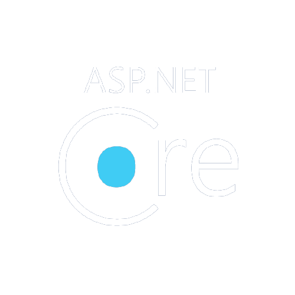
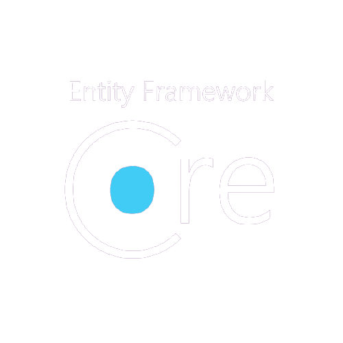
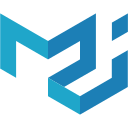
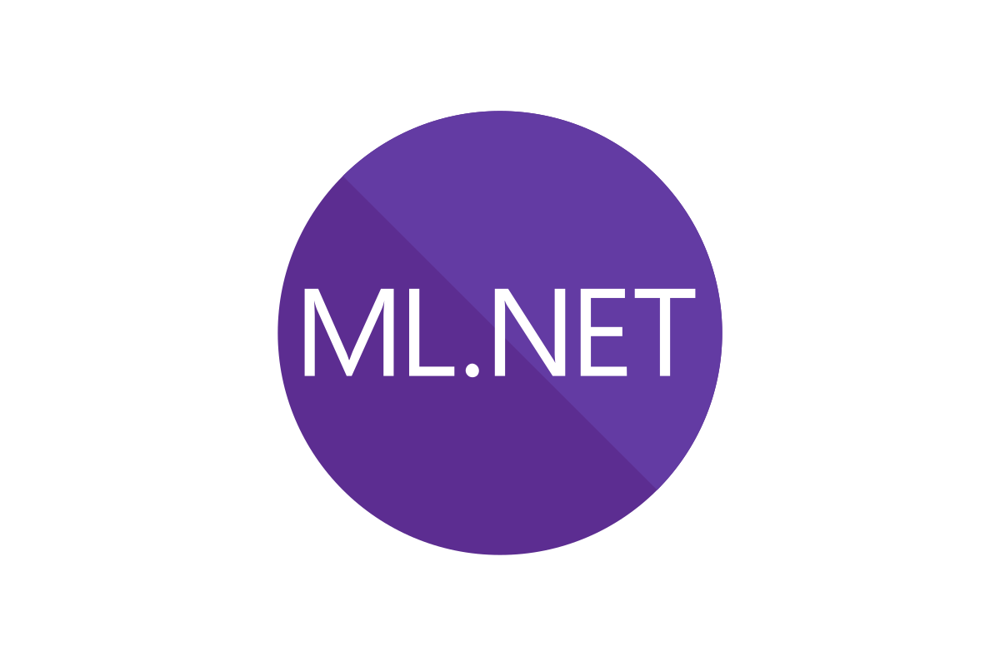

# Shagotom 👋🏽

> (means *welcome* in Bengali)

I am **Ahad Chowdhury**, originally from Dhaka 🇧🇩 — currently living in Sydney 🇦🇺

- working part-time as a Software Engineer at [Apollo International](https://www.apollointl.com.au) since April 2021
- studying Master of Data Science at [Macquarie University](https://www.mq.edu.au/) since February 2020

## 🧠 Skills

### Core

### Specifics

       
 
       
 
       
 
       
 
    
 
     
 
 

## ⚡ Current activities

- 👨🏽‍💻 Working on [`maacpiash/KonSchool`](https://github.com/maacpiash/KonSchool), [`sadiagroup/website`](https://github.com/sadiagroup/website), and [`maacpiash/back-to-the-basics`](https://github.com/maacpiash/back-to-the-basics).
- 📖 Reading [Clean Code: A Handbook of Agile Software Craftsmanship](https://www.amazon.com.au/dp/0132350882) by Robert C. Martin, and [The Rules of Thinking: A personal code to think yourself smarter, wiser and happier](https://www.amazon.com.au/dp/1292263806) by Richard Templar.
- 💭 Learning [Kubernetes](https://github.com/kubernetes/kubernetes) and [nginx](https://github.com/nginx/nginx).

## 🕚 Previously…

- **🏢 Feb 2019 - Jan 2020**: Worked full-time as a **Junior Software Engineer** at [**Dynamic Solution Innovators Ltd.**](http://dsinnovators.com), Dhaka. Projects I worked on are the [OpenCRVS](https://github.com/opencrvs/opencrvs-core) project and the enterprise solution of [Olwel](https://olwel.com), both are full-stack web applications developed with [React](https://github.com/facebook/react) and [Hapi](https://github.com/hapijs/hapi).
- **💻 Nov 2016 - Apr 2018**: Worked part-time as a **Research Assistant** at [**DESM, North South University**](http://www.northsouth.edu/academic/shls/esm/), Dhaka, on a research project ([relevant news article](http://www.ipsnews.net/2017/05/flying-green-in-bangladesh/)). Used [Windows Forms](https://github.com/dotnet/winforms) to develop the client-side software of *NODES*, an airline management system.
- **🎒 Jan 2014 - Aug 2018**: Studied **Computer Science and Engineering** at [**North South University**](http://www.northsouth.edu), Dhaka, and got a **Bachelor of Science** degree.

For more details, please view my resume at [pia.sh/resume](https://pia.sh/resume).

## 😁 Fun facts about me

I know the value of pi (π) up to 60 decimal places. I also know the names and the symbols of all the elements, along with their positions in the periodic table. Moreover, I can name all 64 [districts of Bangladesh](https://en.wikipedia.org/wiki/Districts_of_Bangladesh).

*I'm a huge nerd, I know!*

## 📫 How to reach me

I am [`@maacpiash`](https://maacpia.sh) (almost) everywhere!

## ❤️ Support my open source projects

